# Chronosaga: The Game

> **A systemic micro-to-macro adventure and management simulator where the world remembers, evolves and reacts.**

**Chronosaga: The Game** is a data-driven simulation game combining exploration, tactical encounters, strategic warfare, management, emergent storytelling, persistent characters, long-term consequences and a local-first AI Dungeon Master.

**Technical codename:** Parametric AI Adventure  
**Status:** Pre-alpha · architecture + vertical-slice development  
**Target platforms:** Web · Windows Full Offline · lightweight HTML/Web demo  
**Source of truth:** GitHub

---

## Table of Contents

- [Vision](#vision)
- [Core Gameplay Loop](#core-gameplay-loop)
- [Product Pillars](#product-pillars)
- [Three Connected Game Engines](#three-connected-game-engines)
- [Core Architectural Rule](#core-architectural-rule)
- [Shared Architecture](#shared-architecture)
- [AI Dungeon Master](#ai-dungeon-master)
- [Dual Local AI Profiles](#dual-local-ai-profiles)
- [Windows Full Offline](#windows-full-offline)
- [Browser and Web AI](#browser-and-web-ai)
- [Hardware Targets](#hardware-targets)
- [VPS Target](#vps-target)
- [UI / Visual Direction](#ui--visual-direction)
- [Lovable Role](#lovable-role)
- [Repository Structure](#repository-structure)
- [Development Workflow](#development-workflow)
- [Current Bootstrap](#current-bootstrap)
- [Local Development](#local-development)
- [Documentation](#documentation)
- [Backup Strategy](#backup-strategy)
- [Copyright and Usage](#copyright-and-usage)

---

# Vision

Chronosaga begins at a human scale — one character, a small party, limited resources, relationships and exploration — and can progressively expand toward settlements, factions, territories, economies, armies and long-running political systems.

The macro layer must never erase the personal layer.

A companion betrayed early in a campaign may later return as a faction leader.  
A tactical sabotage mission may alter the outcome of a war.  
A war may destroy production, trigger migration, reshape prices and destabilize a government.  
A local political decision may create consequences that surface years later.

The target is not a collection of disconnected minigames. The target is **one persistent world viewed at multiple scales**.

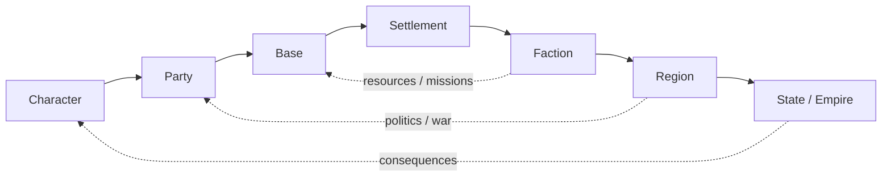

---

# Core Gameplay Loop

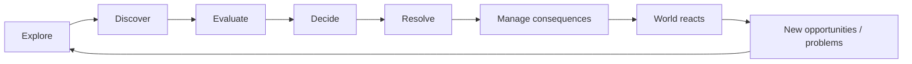

The game should continuously produce a sense that the world existed before the player arrived and will continue moving after every decision.

---

# Product Pillars

1. **Systemic World** — the world evolves even without direct player intervention.
2. **Meaningful Choice** — important choices persist and may create delayed consequences.
3. **Micro → Macro** — character/party management can grow into settlement, faction and army-scale strategy.
4. **Emergent Story** — stories arise from interacting systems, not only predefined branches.
5. **Living Characters** — memory, relationships, goals, loyalty, fear, wounds and changing opinions.
6. **Persistent Consequences** — recovery is possible, but important mistakes can permanently reshape the campaign.
7. **Hard-Sci-Fi Operating UI** — dense, credible mission-control presentation rather than a generic game dashboard.
8. **Local-First Generative AI** — offline generative narration is a product requirement for the Windows edition.
9. **Deterministic Authority** — AI never replaces the Simulation Core.
10. **Modular Expansion** — systems and content grow through shared data, rules and adapters.

---

# Three Connected Game Engines

Chronosaga uses three resolution layers connected to the same authoritative `WorldState`.

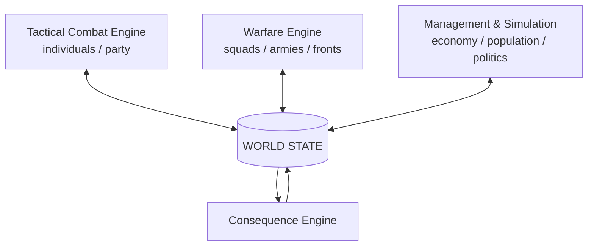

## Tactical Combat

Planned direction:

- tabletop-RPG familiarity with original rules;
- d100 resolution;
- six base attributes + derived statistics;
- archetypes as starting identity, then freer progression;
- movement + main action + reactions;
- equipment depth;
- wounds, stress, morale and permanent injuries;
- prosthetics / implants as recovery or enhancement paths;
- NPC hesitation, refusal or betrayal when justified by state and relationships;
- later evolution toward richer positional combat.

## Warfare

Large conflict is not individual combat multiplied by thousands.

```text
SQUAD
  ↓
COMPANY GROUP
  ↓
BATTLE GROUP
  ↓
ARMY / FRONT
```

Resolution considers:

- manpower;
- equipment;
- training;
- experience;
- morale;
- cohesion;
- commanders;
- terrain;
- supply;
- ammunition;
- intelligence;
- weather;
- technology;
- fatigue;
- plans and communications.

Army battles may create **focus encounters** playable at Tactical scale, while Tactical operations may modify strategic conditions.

## Management & Simulation

Management operates through world ticks, planning cycles, policies and delegation rather than turning every system into manual spreadsheet work.

Planned domains include:

- resources;
- production chains;
- supply;
- population cohorts;
- migration;
- internal politics;
- diplomacy;
- factions;
- research;
- settlements;
- regional control;
- economy and prices.

---

# Core Architectural Rule

> **The AI does not control the game. The Simulation Core does.**

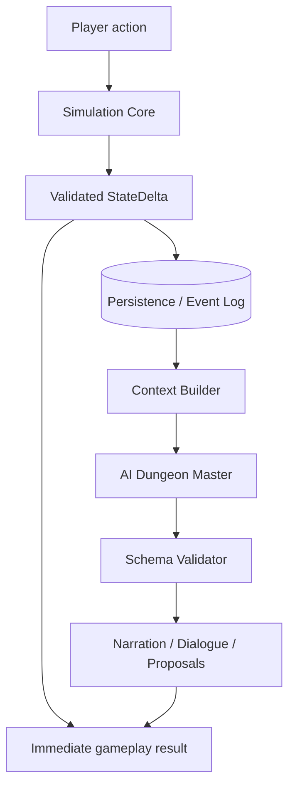

The database remembers.  
The Simulation Core decides.  
The AI interprets.

The state commit does **not** wait for the generative model.

This separation is central to the project because it makes compact local models practical and prevents AI failure from becoming gameplay failure.

---

# Shared Architecture

Web and Windows are different process topologies built from the same project, not separate games.

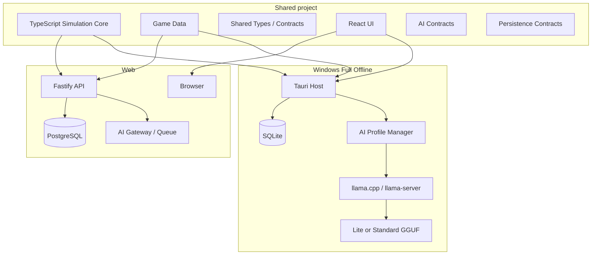

## Adapter boundary

```text
WEB
PersistenceAdapter → PostgreSQL via API
AIAdapter          → VPS AI / optional provider
AssetAdapter       → server storage

WINDOWS
PersistenceAdapter → SQLite
AIAdapter          → local llama.cpp
AssetAdapter       → local filesystem
```

`packages/game-core` must remain independent from browser, Node, PostgreSQL, SQLite, Tauri and any specific AI provider.

---

# AI Dungeon Master

The AI layer may:

- generate narration and dialogue;
- interpret validated consequences;
- create context-compatible narrative variations;
- propose events for Core validation;
- propose memory updates;
- enrich characters and locations;
- summarize relevant history;
- support prompt generation for later visual systems.

It may **not** arbitrarily change:

- damage;
- resources;
- economy;
- mortality;
- territory;
- combat results;
- authoritative relationships;
- world ticks;
- probabilities.

## AI pipeline

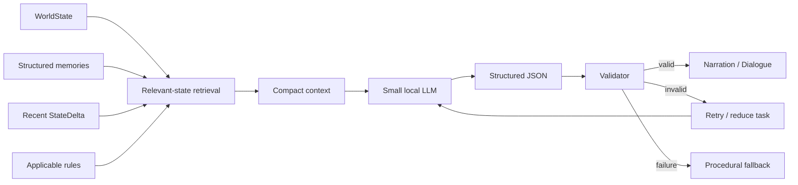

Planned provider abstraction:

```text
LocalModelProvider
CloudModelProvider
ProceduralFallbackProvider
```

The game remains playable with no generative AI available.

---

# Dual Local AI Profiles

Chronosaga now plans **two selectable local model classes** for Windows Full Offline.

| Profile | Class | Current benchmark candidate | Planning model size | Intended target |
|---|---:|---|---:|---|
| **Lite** | ~1.7B | Qwen3-1.7B class | ~1.0–1.5 GB | lower hardware / faster inference |
| **Standard** | ~3B | SmolLM3-3B class | ~1.8–2.5 GB | recommended narrative experience |

The exact GGUF build, quantization, hash and release license are **not locked** until P0 benchmarking and release-license validation.

## Model selector

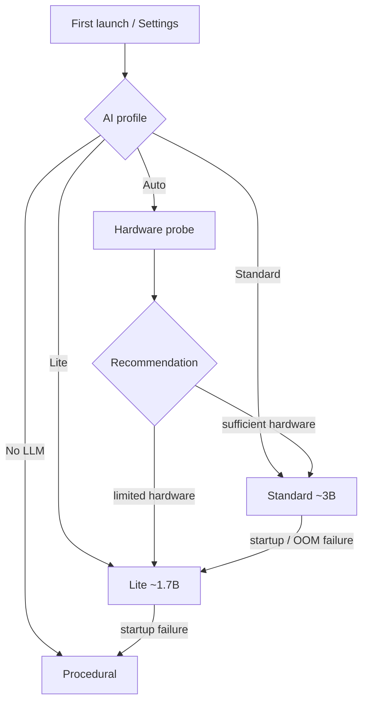

The menu must show **before selection**:

- approximate model download/install size;
- provisional minimum RAM;
- recommended RAM;
- GPU requirement (`not required` for current target);
- optional recommended VRAM;
- expected quality/speed trade-off;
- detected hardware;
- recommended profile.

Only **one local LLM should normally be resident in RAM at a time**.

## Important package-size consequence

Bundling both models means the model payload alone is currently planned around:

```text
Lite      ~1.0–1.5 GB
Standard  ~1.8–2.5 GB
---------------------
Total     ~2.8–4.0 GB
```

Therefore a Windows package containing **both** profiles should not be expected to remain around 2 GB total.

A future `Compact` installer may contain Lite only, but the default Full Offline architecture supports both profiles.

See [`docs/LOCAL_AI_MODEL_PROFILES_v0.1.md`](./docs/LOCAL_AI_MODEL_PROFILES_v0.1.md).

---

# Windows Full Offline

The Full Offline edition is designed to work after one normal installation, with no Python, Node, Ollama, external database or manual AI setup required.

```text
Chronosaga Setup
      ↓
Chronosaga.exe
├── Tauri / React UI
├── Simulation Core
├── Game Data
├── SQLite
├── llama.cpp runtime
├── Lite GGUF (~1.7B)
├── Standard GGUF (~3B)
├── assets
└── save system
```

Runtime lifecycle:

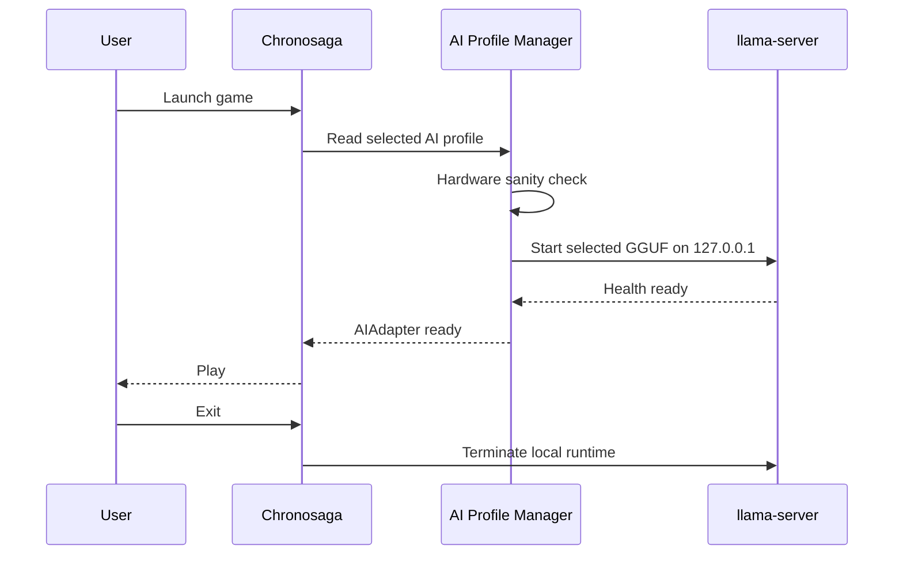

The local AI process must bind only to loopback and must not expose arbitrary file/tool access to the model.

---

# Browser and Web AI

The browser version uses a different topology.

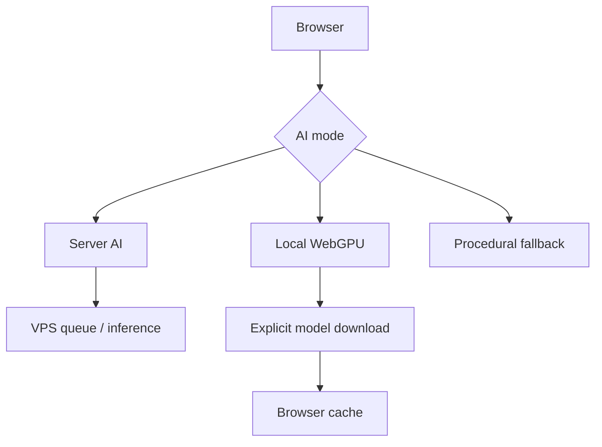

## Planned modes

**Server AI**  
Primary compatibility path for the hosted game.

**Local WebGPU**  
Optional local inference. The model is downloaded on demand, not embedded into the initial webpage. Lite is the first target; Standard is hardware-dependent.

**Procedural**  
Always-available no-LLM fallback.

The site must not silently download gigabytes of model data.

---

# Hardware Targets

All values below are **provisional planning targets** until P0 benchmark results exist.

| Requirement | Lite ~1.7B | Standard ~3B |
|---|---|---|
| RAM minimum target to validate | **8 GB** | **16 GB** |
| RAM recommended | **16 GB** | **16–32 GB** |
| CPU target | modern x64, 4+ cores | modern x64, 6+ cores recommended |
| Dedicated GPU | not required | not required |
| Useful VRAM if accelerated | ~4 GB | ~6 GB+ |
| Initial context target | ~4k | ~4k–8k |
| Model storage planning | ~1.0–1.5 GB | ~1.8–2.5 GB |

The final requirements will be based on measured:

- startup time;
- RAM peak;
- CPU utilization;
- token throughput;
- time-to-first-token;
- 2k / 4k / 8k context behavior;
- JSON compliance;
- Italian narrative quality;
- repetition / contradiction rates.

---

# VPS Target

Current deployment target to benchmark:

```text
6 CPU cores
12 GB RAM
200 GB storage
GPU not assumed
```

Planned AI strategy:

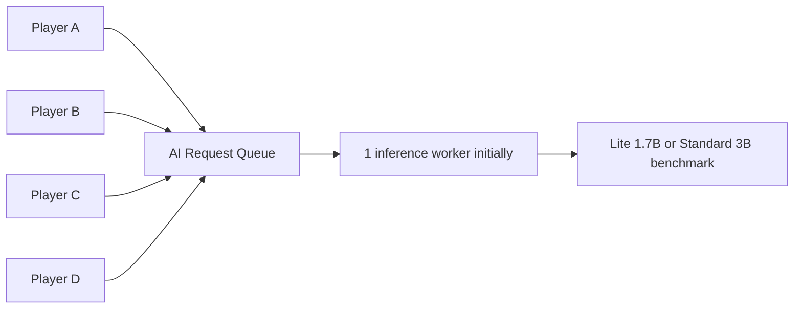

The VPS must first prove:

- Lite stability;
- Standard memory fit;
- acceptable CPU-only latency;
- 1 request performance;
- 2 simultaneous requests;
- 5 queued requests;
- no OOM while API + PostgreSQL + OS are active.

A model fitting into memory does **not** automatically imply adequate multi-user throughput.

---

# UI / Visual Direction

The interface targets a 50/50 balance between **game readability** and **diegetic operating system**.

Visual principles:

- near-black surfaces;
- restrained cyan/teal operational layer;
- amber actions and warnings;
- red/magenta danger layer;
- technical mono typography for telemetry;
- readable sans typography for longer narrative text;
- sharp geometry;
- thin borders;
- high but organized information density;
- resizable/collapsible desktop panels;
- saved layout presets;
- dedicated but coherent Tactical / Warfare / Management presentations;
- Analysis Mode for formulas and causal explanations;
- informational fog of war by default.

Avoid:

- generic SaaS dashboards;
- glassmorphism as the main language;
- oversized rounded cards;
- decorative neon gradients;
- a central ChatGPT-like chatbox;
- animation without informational purpose.

## Primary shell concept

```text
┌──────────────────────────────────────────────────────────────┐
│ LOCATION │ TIME │ ALERTS │ RESOURCES │ WORLD / SYSTEM STATE │
├────────────┬────────────────────────────┬────────────────────┤
│            │                            │                    │
│ PARTY /    │       MAIN VIEWPORT        │ EVENT / INTEL /    │
│ ENTITIES   │                            │ DIRECTIVES         │
│            │                            │                    │
├────────────┴────────────────────────────┴────────────────────┤
│ EVENT LOG │ CONTEXT │ TIMELINE │ SYSTEM STATUS              │
└──────────────────────────────────────────────────────────────┘
```

See:

- `docs/UI_VISUAL_SYSTEM_v0.1.md`
- `docs/LOVABLE_IMPLEMENTATION_BRIEF_v0.1.md`

---

# Lovable Role

Lovable is an **UI/UX implementation accelerator**, not the Simulation Core and not the source of truth.

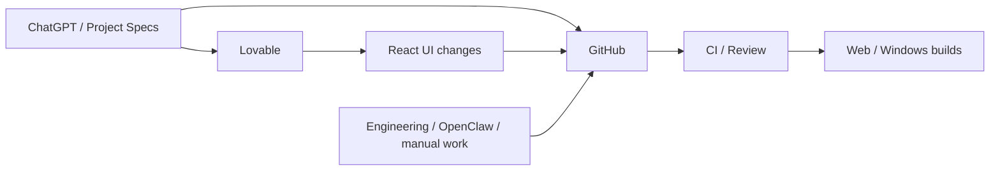

Lovable may work on:

- React components;
- layout;
- visual system;
- interactions;
- responsive desktop behavior;
- Tactical/Warfare/Management presentation;
- settings, including the Local AI profile selector.

Lovable must not invent authoritative gameplay calculations inside UI components.

---

# Repository Structure

```text
apps/
├── web/                    # React/Vite client
├── server/                 # Fastify API
└── desktop/                # Tauri Windows shell

packages/
├── game-core/              # Authoritative Simulation Core
├── game-data/              # Data-driven definitions
├── game-types/             # Shared TypeScript contracts
├── ui-system/              # Visual-system primitives/tokens
├── ai-contracts/           # AI-DM provider contracts
├── persistence-contracts/  # Web/Desktop persistence abstraction
└── procedural-narrator/    # AI-free fallback narration

data/                       # JSON game content
assets/                     # Project assets and placeholders
models/                     # Candidate profile manifest; no weights
infra/                      # Docker / Nginx / deployment scripts
docs/                       # Product + technical Knowledge
tests/                      # Cross-system tests
```

Model weights and third-party AI binaries are intentionally excluded from Git.

---

# Development Workflow

GitHub is the source of truth.

Current preferred workflow:

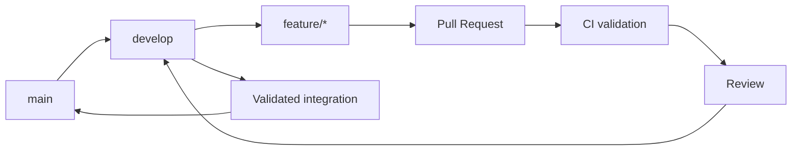

Rules:

1. Product/spec work is documented before implementation when it changes architecture.
2. New implementation work should normally use a feature branch.
3. Pull Requests target `develop`.
4. CI must pass before merge.
5. `main` represents the stable integration line.
6. Major project snapshots should be backed up outside GitHub as well.

---

# Current Bootstrap

The repository currently includes:

- deterministic seed-based Simulation Core bootstrap;
- event eligibility, selection and resolution;
- explicit `StateDelta`;
- sample parametric events;
- procedural AI fallback;
- React hard-SF vertical slice scaffold;
- Fastify API;
- Docker/PostgreSQL scaffold;
- Nginx reverse proxy;
- Tauri Windows shell scaffold;
- dual-profile local-model manifest;
- GitHub CI with source snapshots;
- product Knowledge;
- Game Systems Schema;
- UI Visual System;
- Lovable implementation brief;
- local AI dual-profile architecture.

## Not yet production-complete

- PostgreSQL production persistence adapter and migrations;
- SQLite desktop persistence adapter;
- bundled llama.cpp runtime;
- final GGUF builds;
- actual Lite/Standard model switching implementation;
- hardware probe;
- WebGPU local inference integration;
- final P0 benchmark;
- final balancing of Tactical/Warfare/Management systems;
- authentication;
- production deployment/security hardening;
- final Windows installer and code signing.

---

# Local Development

Requirements:

- Node.js LTS;
- pnpm;
- Docker Desktop or compatible Docker runtime for PostgreSQL;
- Rust + Tauri prerequisites only for desktop builds.

```bash
pnpm install
docker compose up -d db
pnpm dev
```

Development endpoints:

```text
Web     http://localhost:5173
API     http://localhost:3001
Health  http://localhost:3001/api/v1/health
```

Useful checks:

```bash
pnpm typecheck
pnpm test
pnpm build
```

---

# Documentation

The `/docs` directory is part of the specification and should be treated as project Knowledge, not optional background material.

Current key documents:

| Document | Purpose |
|---|---|
| `PRODUCT_VISION_LOCKED_v1.md` | product identity and non-negotiables |
| `PARAMETRIC_AI_ADVENTURE_PROJECT_KNOWLEDGE.md` | general project Knowledge |
| `TECHNICAL_ROADMAP_v0.1.md` | technical implementation roadmap |
| `PLATFORM_DISTRIBUTION_LOCAL_AI_FEASIBILITY_v1.md` | platform / packaging / AI feasibility |
| `GAME_SYSTEMS_SCHEMA_v0.1.md` | Tactical, Warfare, Management and consequences |
| `UI_VISUAL_SYSTEM_v0.1.md` | UI/UX visual system |
| `LOVABLE_IMPLEMENTATION_BRIEF_v0.1.md` | Lovable execution contract |
| `LOCAL_AI_MODEL_PROFILES_v0.1.md` | Lite/Standard local AI architecture and hardware planning |
| `KNOWLEDGE_INDEX_v1.md` | precedence and Knowledge map |
| `IMPLEMENTATION_BACKLOG_v0.1.md` | implementation backlog |

Planned next specification documents include:

- `AI_DM_PROTOCOL_v0.1.md`;
- `DATA_SCHEMA_v0.1.md`;
- `P0_BENCHMARK_PLAN_v0.1.md`.

---

# Backup Strategy

Git is the development source of truth, but a second project copy should be maintained externally.

```text
GitHub
  │
  ├── branches / commits / PRs
  ├── CI source snapshot
  │
  └─────────────┐
                ▼
        External backup
        └── Google Drive project archive
```

Recommended backup package contains:

- exact Git source snapshot;
- current Knowledge documents;
- visual reference assets that are not appropriate for Git;
- manifest describing branch, commit and PR state.

---

# Development Philosophy

1. Simulation before narration.
2. Systems before content volume.
3. Consequences before cosmetic choice.
4. Persistence before the illusion of memory.
5. Depth before breadth.
6. AI only where it adds measurable value.
7. No generative service may become a single point of failure.
8. Avoid generic procedural content and **AI slop**.
9. Keep Web and Windows on one shared core.
10. Benchmark technical assumptions before locking them.
11. UI complexity must be matched by delegation and explainability.
12. A larger model may improve expression, but it must never become the authority of the game world.

---

# Copyright and Usage

**Copyright © 2026 Simone Macelloni. All rights reserved.**

The source code and project assets in this repository are publicly viewable but are **not released under an open-source license**.

Unless the copyright holder grants explicit permission, no permission is granted to reproduce, redistribute, sublicense, sell, commercially exploit or create derivative works from the project's proprietary code, documentation, visual assets or original game content.

GitHub platform functionality and third-party dependencies remain subject to their own terms and licenses.

Third-party runtimes and AI models distributed with a release must retain their required licenses, notices and attributions independently of Chronosaga's proprietary license.

See [`COPYRIGHT.md`](./COPYRIGHT.md).

---

# Project Principle

> **Chronosaga should not be compelling because it “uses AI.” It should be compelling because it simulates a persistent world whose systems produce consequences — and uses AI selectively to make those consequences feel alive.**
