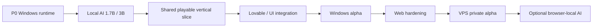
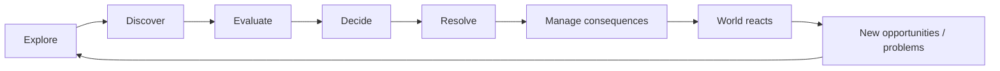
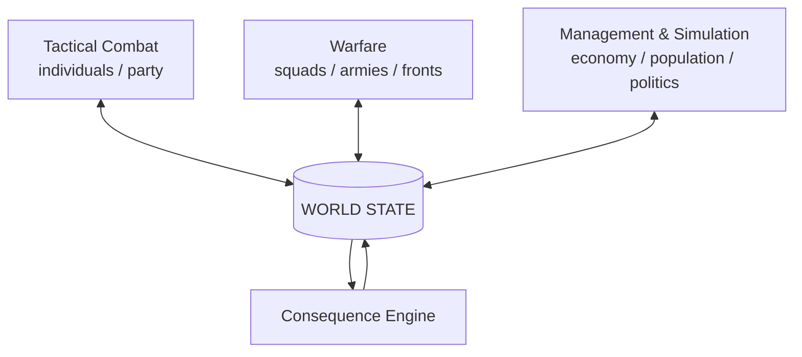
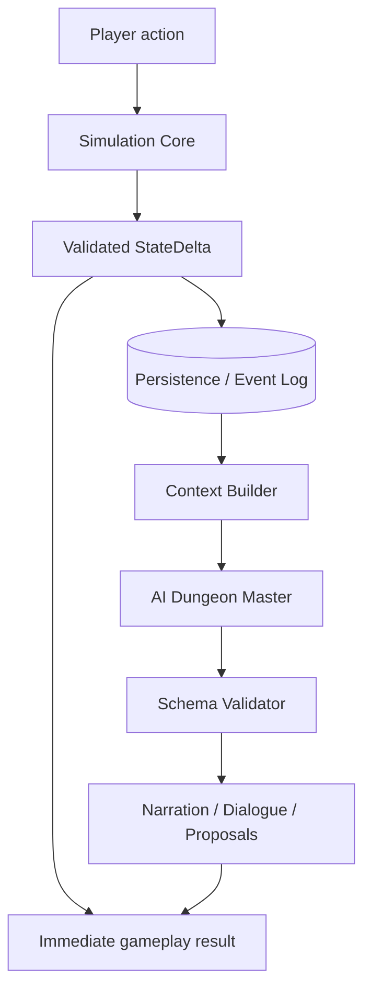
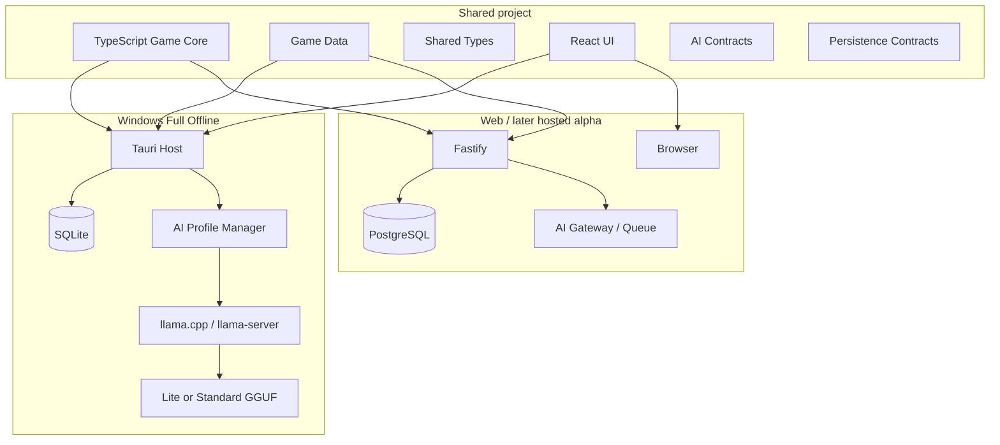
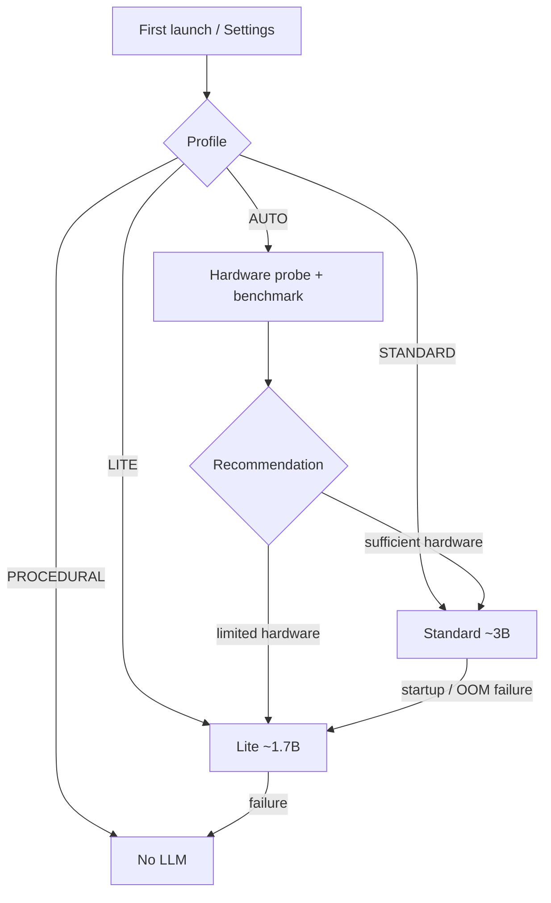
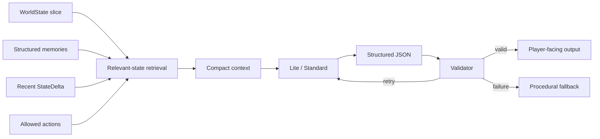
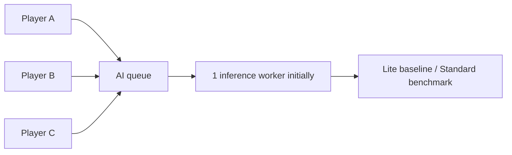
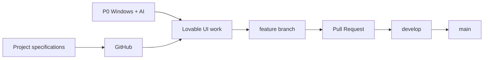
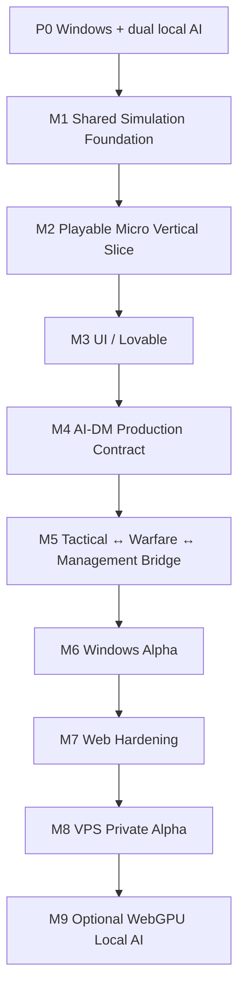

# Chronosaga: The Game

> **A systemic micro-to-macro adventure and management simulator where the world remembers, evolves and reacts.**

**Chronosaga: The Game** is a data-driven simulation game combining exploration, tactical encounters, strategic warfare, management, persistent characters, emergent storytelling, long-term consequences and a local-first AI Dungeon Master.

**Technical codename:** Parametric AI Adventure  
**Status:** Pre-alpha · architecture + P0 feasibility + vertical-slice development  
**Primary delivery priority:** **Windows Full Offline first**  
**Secondary target:** Web-compatible shared build  
**Hosted/VPS target:** later private alpha  
**Source of truth:** GitHub

---

## Current Strategy

Chronosaga is **Windows-first, not Windows-only**.



The Web target remains alive throughout development because the Simulation Core, data contracts and most UI are shared. What is deliberately postponed is the expensive operational layer: authentication, multi-user scaling, server AI concurrency and public VPS deployment.

Lovable remains part of the implementation workflow, but advanced UI production follows the Windows/local-AI P0 gate so visual work does not hide unresolved runtime constraints.

---

# Vision

Chronosaga begins at a human scale — one character, a small party, limited resources, relationships and exploration — and can progressively expand toward settlements, factions, territories, economies, armies and long-running political systems.

The macro layer must never erase the personal layer.


A companion betrayed early in a campaign may later return as a faction leader. A tactical mission may change a war. A war may destroy production, trigger migration, reshape prices and destabilize government. A local choice may surface again hours later through a completely different system.

The target is **one persistent world viewed at multiple scales**.

---

# Core Gameplay Loop



The player should repeatedly feel that the world is progressing even when they are not directly touching every system.

---

# Product Pillars

1. **Systemic World** — the world evolves without waiting for the player.
2. **Meaningful Choice** — important actions persist and may trigger delayed consequences.
3. **Micro → Macro** — character-scale play can grow into settlement, faction and army-scale decisions.
4. **Emergent Story** — stories arise from interacting systems, not only scripted branches.
5. **Living Characters** — memory, loyalty, fear, stress, wounds, goals and changing relationships.
6. **Persistent Consequences** — mistakes may reshape the campaign instead of simply resetting it.
7. **Hard-SF Operating UI** — dense, credible mission-control presentation rather than generic SaaS/game cards.
8. **Local-First AI** — Windows must support offline generative narration without external APIs.
9. **Deterministic Authority** — AI never replaces the Simulation Core.
10. **Graceful Degradation** — if the LLM fails, gameplay continues through procedural fallback.

---

# Three Connected Engines

Chronosaga uses three gameplay layers connected to the same authoritative `WorldState`.



## Tactical

Planned foundations:

- d100 resolution;
- six base attributes + derived stats;
- archetypes as starting identity, then freer progression;
- Move + Main Action + Reaction;
- deep equipment;
- wounds, stress, morale and persistent injury;
- implants/prosthetics;
- NPC hesitation, refusal, abandonment or betrayal when justified by state.

## Warfare

Large battles use aggregate military units rather than simulating every soldier individually.

```text
SQUAD
  ↓
COMPANY GROUP
  ↓
BATTLE GROUP
  ↓
ARMY / FRONT
```

Resolution can consider manpower, equipment, training, morale, command, terrain, logistics, intelligence, weather, fatigue and plan selection. Strategic battles may generate Tactical focus encounters.

## Management & Simulation

Management grows progressively from party/base to settlement/faction/region and includes resources, production, population cohorts, migration, politics, diplomacy, research and delegation.

---

# Core Architectural Rule

> **The AI does not control the game. The Simulation Core does.**



The database remembers.  
The Simulation Core decides.  
The AI interprets.

The state commit does **not** wait for generative narration.

---

# Shared Architecture

Windows and Web are different process topologies around one shared game.



## Platform adapters

```text
WINDOWS
PersistenceAdapter → SQLite
AIAdapter          → local llama.cpp
AssetAdapter       → local filesystem

WEB
PersistenceAdapter → PostgreSQL via API
AIAdapter          → server AI / optional provider
AssetAdapter       → server storage
```

`packages/game-core` must not depend on Tauri, SQLite, PostgreSQL, browser APIs or a specific LLM.

---

# Windows-First P0

The immediate engineering gate is defined in [`docs/P0_WINDOWS_LOCAL_AI_BENCHMARK_PLAN_v0.1.md`](./docs/P0_WINDOWS_LOCAL_AI_BENCHMARK_PLAN_v0.1.md).

The P0 must prove:

```text
INSTALL
  ↓
Tauri app starts
  ↓
SQLite save/load
  ↓
hardware probe
  ↓
Lite / Standard / Procedural selection
  ↓
llama-server sidecar starts
  ↓
structured generation
  ↓
validator / fallback
  ↓
clean shutdown + restart
```

The gate produces measured results instead of assumptions about hardware requirements.

---

# Dual Local AI Profiles

Chronosaga plans two local model classes using the same `AIAdapter`.

| Profile | Class | Current benchmark candidate | Planning size | Purpose |
|---|---:|---|---:|---|
| **Lite** | ~1.7B | Qwen3-1.7B class | ~1.0–1.5 GB | lower RAM / faster inference |
| **Standard** | ~3B | SmolLM3-3B class | ~1.8–2.5 GB | richer recommended narration |

Exact GGUF builds, quantization, hashes, licenses and final requirements remain **PROVISIONAL until P0**.

## Selector



The menu must show model size, RAM target, recommended RAM, GPU requirement, detected hardware and quality/speed trade-off before selection.

Only one LLM should normally be resident in RAM at a time.

## Planning hardware targets

| Requirement | Lite ~1.7B | Standard ~3B |
|---|---|---|
| RAM minimum to validate | 8 GB | 16 GB |
| RAM recommended | 16 GB | 16–32 GB |
| CPU target | modern x64 / 4+ cores | modern x64 / 6+ cores recommended |
| Dedicated GPU | not required | not required |
| Useful VRAM if accelerated | ~4 GB | ~6 GB+ |
| Context target | ~4k | ~4k–8k |

These are planning values only. The P0 replaces them with measured values.

---

# AI Dungeon Master

The AI may generate:

- narration;
- dialogue;
- grounded variations;
- event proposals for validation;
- memory suggestions;
- summaries;
- location/character prose.

It may not decide authoritative damage, economy, resources, territory, mortality, probabilities or relationship numbers.



---

# Windows Full Offline

The release target is a normal installable Windows application requiring no manual Python, Node, Ollama or database setup.

```text
Chronosaga
├── Tauri / React
├── Game Core
├── Game Data
├── SQLite
├── AI Profile Manager
├── llama.cpp runtime
├── Lite GGUF
├── Standard GGUF
├── assets
└── save system
```

Two packaging strategies remain compatible:

```text
FULL OFFLINE
Game + Lite + Standard

COMPACT
Game + Lite
Standard = optional model pack
```

Bundling both model classes implies a model payload of roughly **2.8–4.0 GB** before game/runtime/assets, so the full package should not be assumed to be ~2 GB total.

---

# Web and VPS

Web is not abandoned; it is deliberately sequenced later.

During Windows-first development CI should continue to build shared packages, Web and server code so architectural compatibility is preserved.

Hosted alpha comes after the Windows vertical slice proves the game is worth hosting.

Current VPS target:

```text
6 CPU cores
12 GB RAM
200 GB SSD
GPU not assumed
```

Later topology:



The later VPS gate will test API + PostgreSQL + Game Core + AI worker under 1, 2 and 5 queued requests.

Browser-local WebGPU inference is an optional later experiment, with Lite as the first target. The browser must never silently download multi-GB models.

---

# UI / Lovable

The visual target is a 50/50 balance between **game readability** and **diegetic operating system**.

Principles:

- near-black surfaces;
- cyan/teal operational layer;
- amber warnings/actions;
- red/magenta danger;
- restrained green positive states;
- mono for telemetry, readable sans for prose;
- sharp geometry;
- thin borders;
- dense but organized information;
- no generic SaaS dashboard;
- no permanent central AI chatbot.

Lovable is part of the workflow, but advanced implementation follows the Windows/local-AI P0 gate.



Lovable builds UI and interaction. It does **not** become the Simulation Core.

---

# Repository Structure

```text
apps/
├── web/                    # React/Vite client
├── server/                 # Fastify API
└── desktop/                # Tauri Windows shell

packages/
├── game-core/              # authoritative Simulation Core
├── game-data/              # data-driven definitions
├── game-types/             # shared TypeScript contracts
├── ui-system/              # visual primitives/tokens
├── ai-contracts/           # AI-DM contracts
├── persistence-contracts/  # platform persistence boundary
└── procedural-narrator/    # no-LLM fallback

models/                     # manifests only; no model weights
data/                       # game content
assets/                     # project assets/placeholders
infra/                      # Docker/Nginx/deployment
docs/                       # authoritative project specifications
tests/                      # cross-system tests
```

---

# Development Roadmap

The current authoritative technical sequence is in [`docs/TECHNICAL_ROADMAP_v0.2.md`](./docs/TECHNICAL_ROADMAP_v0.2.md).



Until the first playable vertical slice, the intended focus is approximately:

```text
Game systems / Core       40%
Windows + local AI        25%
UI / Lovable              20%
Tests / tooling            10%
Web / VPS                   5%
```

---

# Development Workflow

```text
feature/*
    ↓ Pull Request
 develop
    ↓ integration / validation
 main
```

`main` should represent validated state. New feature work should normally not be committed directly to `main`.

GitHub remains the source of truth. Backup snapshots may also be preserved on Google Drive.

---

# Current Bootstrap

The repository currently contains architecture/bootstrap work for:

- deterministic seed-based Game Core;
- event eligibility and resolution;
- explicit StateDelta;
- procedural narration fallback;
- React hard-SF UI scaffold;
- Fastify API scaffold;
- Docker/PostgreSQL scaffold;
- Tauri Windows scaffold;
- local-model manifest;
- GitHub CI;
- gameplay/system specifications;
- UI Visual System;
- Lovable implementation brief;
- dual local AI profiles;
- Windows-first P0 benchmark plan.

Not yet proven production-ready:

- real Windows installer flow;
- SQLite persistence adapter;
- llama.cpp sidecar lifecycle;
- final Lite/Standard GGUF selection;
- measured hardware requirements;
- final AI-DM protocol;
- full Tactical/Warfare/Management implementations;
- production PostgreSQL persistence;
- hosted VPS runtime.

---

# Documentation

Key documents:

- `PRODUCT_VISION_LOCKED_v1.md`
- `GAME_SYSTEMS_SCHEMA_v0.1.md`
- `UI_VISUAL_SYSTEM_v0.1.md`
- `LOCAL_AI_MODEL_PROFILES_v0.1.md`
- `P0_WINDOWS_LOCAL_AI_BENCHMARK_PLAN_v0.1.md`
- `TECHNICAL_ROADMAP_v0.2.md`
- `LOVABLE_IMPLEMENTATION_BRIEF_v0.1.md`
- `PLATFORM_DISTRIBUTION_LOCAL_AI_FEASIBILITY_v1.md`
- `KNOWLEDGE_INDEX_v1.md`
- `IMPLEMENTATION_BACKLOG_v0.1.md`

The `/docs` directory is part of the project specification, not optional background material.

---

# Copyright and Usage

**Copyright © 2026 Simone Macelloni. All rights reserved.**

The source code, documentation and project assets are publicly viewable but are **not released under an open-source license**.

No permission is granted to reproduce, redistribute, sublicense, sell, commercially exploit or create derivative works from proprietary project material except where explicitly authorized by the copyright holder. Third-party dependencies, runtimes and model artifacts remain subject to their own licenses and terms.

See [`COPYRIGHT.md`](./COPYRIGHT.md).

---

# Project Principle

> **Chronosaga should not be compelling because it “uses AI.” It should be compelling because it simulates a persistent world whose systems produce consequences — and uses AI selectively to make those consequences feel alive.**